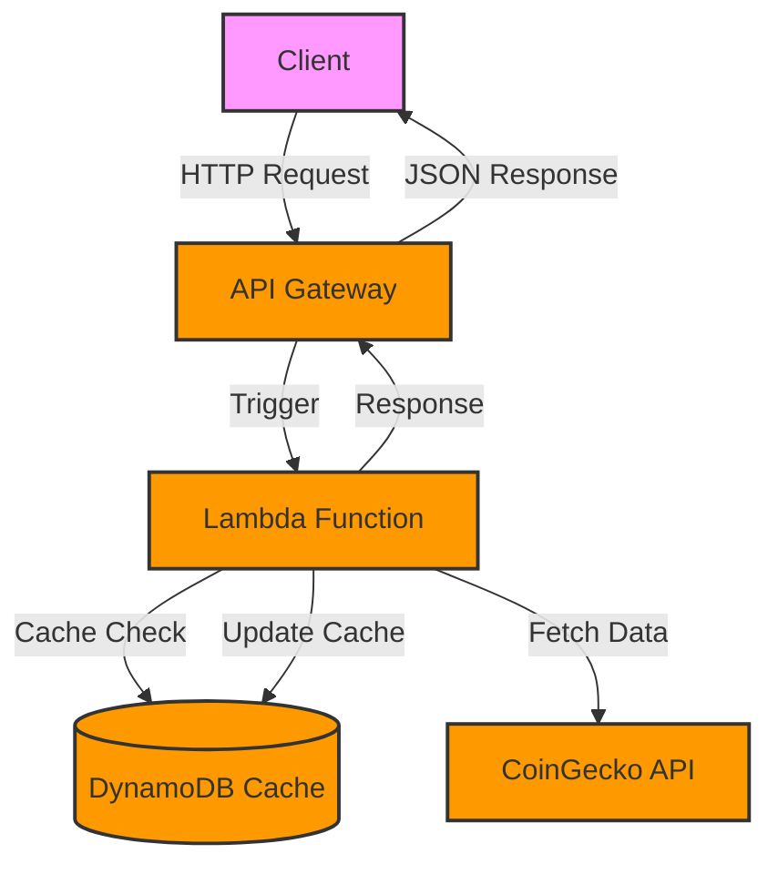

# 🪙 AWS SAM Coin Lister

[](https://aws.amazon.com/serverless/sam/)
[](https://nodejs.org/)
[](LICENSE.md)
[](CONTRIBUTING.md)
[](https://github.com/ozers/aws-sam-coin-lister/graphs/commit-activity)
[](https://github.com/ozers/aws-sam-coin-lister/stargazers)

### 🌟 A serverless cryptocurrency API built with AWS SAM and Lambda.

#### 📊 Get real-time cryptocurrency data with DynamoDB caching for optimal performance.



## 🚀 Quick Start

```bash
# Clone & Install
git clone https://github.com/ozers/aws-sam-coin-lister.git
cd aws-sam-coin-lister/list-coins && npm install && cd ..

# Build & Deploy
sam build && sam deploy --guided
```

## 🌐 API Endpoints

| Endpoint | Method | Cache TTL | Description |
|----------|---------|-----------|-------------|
| `/ping` | GET | 5 min | Health check endpoint |
| `/coins/list` | GET | 30 min | List all coins with pagination |
| `/coins/{coinId}` | GET | 5 min | Get specific coin details |
| `/coins/{coinId}/history` | GET | 1 hour | Get coin price history |

### 📝 Example Usage

```bash
# Health check
curl https://{api-id}.execute-api.{region}.amazonaws.com/Prod/ping

# List coins
curl https://{api-id}.execute-api.{region}.amazonaws.com/Prod/coins/list?page=1&per_page=100

# Get Bitcoin details
curl https://{api-id}.execute-api.{region}.amazonaws.com/Prod/coins/bitcoin
```

## 🛠️ Tech Stack

* 🟦 **Serverless**: AWS SAM, Lambda, API Gateway
* 💾 **Cache**: DynamoDB
* 📊 **Data**: CoinGecko API
* 🧪 **Testing**: Jest

## 📋 Prerequisites

* AWS Account & SAM CLI
* Node.js 18.x
* Docker (optional)

## 🧹 Cleanup

```bash
# Delete stack
sam delete

# Verify
aws cloudformation describe-stacks --stack-name sam-app
```

## 🔍 Troubleshooting

* **Cache Errors**: Normal during testing
* **Deployment Issues**: Check AWS credentials & IAM
* **API Issues**: Verify API ID & region

## 📝 Contributing

1. Fork & Clone
2. Create feature branch
3. Commit & Push
4. Create PR

## 📧 Contact

* [GitHub](https://github.com/ozers)
* [LinkedIn](https://linkedin.com/in/ozersubasi)
* [Email](mailto:ozer@example.com)

---

### 🌟 Made with ❤️ by Ozer SUBASI

[](https://github.com/ozers/aws-sam-coin-lister/stargazers)
[](https://github.com/ozers/aws-sam-coin-lister/network/members)
[](https://github.com/ozers/aws-sam-coin-lister/issues)
